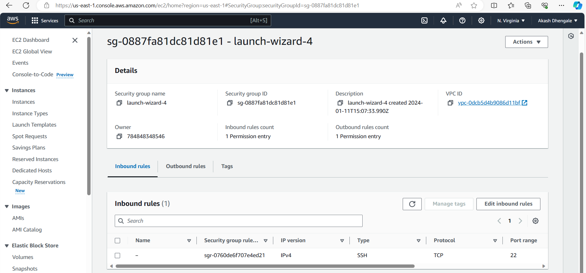
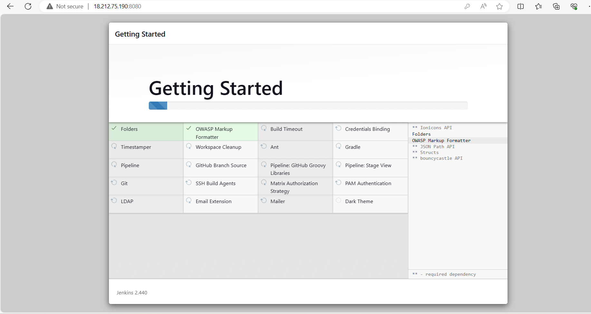
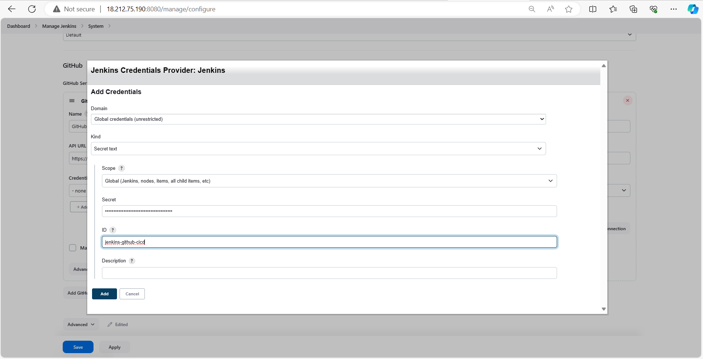

# TODO-Django-CICD

## Introduction

Welcome to the "TODO-Django-CICD" project! This comprehensive guide will walk you through the step-by-step process of setting up and running a Django-based TODO application locally, on AWS EC2, and within Docker containers. In addition, we'll explore the integration of Continuous Integration and Continuous Deployment (CI/CD) pipelines using Jenkins to enhance your development workflow.

## Pre-requisites:

Before you begin, make sure you have the following installed:
Git
Python (with virtualenv)
Docker
Jenkins
Access to an AWS EC2 instance


### Local Setup (VS Code)

### 1. Clone the Repository:
   
```
git clone https://github.com/Akashdhengale/django-todo-cicd.git
```

This command clones the project repository from the specified URL.

### 2. Setup Python Virtual Environment:
   
a. Install virtualenv:

```
pip install virtualenv
```

This command installs the virtualenv package, which is used to create isolated Python environments.

b. Create and activate a virtual environment:

```
python -m venv env
```

```
Set-ExecutionPolicy -Scope Process -ExecutionPolicy Bypass
.\env\Scripts\activate
Set-ExecutionPolicy -Scope Process -ExecutionPolicy Default
```


These commands create a virtual environment named "env" and activate it.

### 3. Install Django:

```
pip install django
```
This command installs the Django framework within the virtual environment.

### 4. Run Django Commands:
   
a. Apply database migrations:

```
python manage.py makemigrations
python manage.py migrate
```

These commands apply database migrations to set up the database for the project.

b. Create a superuser for admin access:

```
python manage.py createsuperuser
```
This command prompts you to enter a username, email, and password for the superuser account.

c. Start the development server:

```
python manage.py runserver
```

This command runs the development server locally, and you can access the application at http://127.0.0.1:8000.

### 5. Create Requirement.txt:

```
pip freeze > requirements.txt
```

This command generates a file named "requirements.txt" containing a list of all installed Python packages and their versions.

## AWS EC2 Setup

1. SSH into Server: 
```
mkdir project
```

```
cd project
```

```
git clone https://github.com/LondheShubham153/django-todo-cicd.git
```


These commands connect to the AWS EC2 instance, create a project directory, and clone the project repository.

2. Install Dependencies:
a. Install Python and pip:

```
sudo apt install python3-pip
```


This command installs Python3 and pip, the package installer for Python.

b. Install Django:
```
pip3 install django
```


This command installs the Django framework globally on the AWS EC2 instance.

3. Run Django Commands:
a. Start the server with external access:

```
python3 manage.py runserver 0.0.0.0:8000
```

This command runs the Django server with external access on port 8000.

b. Apply database migrations:

```
python manage.py migrate
```

This command applies database migrations to set up the database for the project.


Congratuations our todo list is working on aws 





### Docker Container Setup

1. Kill Process which is running on Port 8000:
   
a. Find the process using port 8000:

```
lsof -i:8000
```


This command lists the process using port 8000.

b. Kill the process using the obtained PID:

```
kill -9 <PID>
```

This command forcefully terminates the process using the specified PID.

2. Install Docker:

a. Update package lists and install dependencies:

```
sudo apt-get update
sudo apt-get install ca-certificates curl gnupg
```

These commands update package lists and install required dependencies.

b. Install Docker components:

```
sudo install -m 0755 -d /etc/apt/keyrings
curl -fsSL https://download.docker.com/linux/ubuntu/gpg | sudo gpg --dearmor -o /etc/apt/keyrings/docker.gpg
sudo chmod a+r /etc/apt/keyrings/docker.gpg
```

These commands set up Docker's GPG key and configure the package manager.

```
echo "deb [arch=$(dpkg --print-architecture) signed-by=/etc/apt/keyrings/docker.gpg] https://download.docker.com/linux/ubuntu $(. /etc/os-release && echo "$VERSION_CODENAME") stable" | sudo tee /etc/apt/sources.list.d/docker.list > /dev/null
sudo apt-get update
sudo apt-get install docker-ce docker-ce-cli containerd.io docker-buildx-plugin docker-compose-plugin
```

These commands add the Docker repository, update package lists, and install Docker components.

### 3. Build and Run Docker Container:


a. Build Docker image:

```
sudo docker build . -t todo-app
```


This command builds a Docker image named "todo-app" from the current directory.

b. Run Docker container:

```
sudo docker run -d -p 8000:8000 todo-app
```


This command runs the Docker container in detached mode, mapping port 8000.

## Continuous Integration and Deployment (CI/CD) Pipeline with Jenkins

1. Install Jenkins:

```
sudo apt update && sudo apt upgrade -y
sudo apt install default-jre -y && sudo apt install default-jdk -y
```

These commands update package lists and install Java Runtime Environment (JRE) and Java Development Kit (JDK) for Jenkins.

2. Install Jenkins Using below commands:
   
```
curl -fsSL https://pkg.jenkins.io/debian-stable/jenkins.io-2023.key | sudo tee /usr/share/keyrings/jenkins-keyring.asc > /dev/null
echo deb [signed-by=/usr/share/keyrings/jenkins-keyring.asc] https://pkg.jenkins.io/debian-stable binary/ | sudo tee /etc/apt/sources.list.d/jenkins.list > /dev/null
sudo apt-get update -y
sudo apt-get install jenkins -y
```

These commands add the Jenkins GPG key, configure the package manager, update package lists, and install Jenkins.

3. Start Jenkins Service:

```
sudo systemctl enable jenkins
sudo systemctl start jenkins
sudo systemctl status jenkins
```

These commands enable Jenkins to start on boot, start the Jenkins service, and check its status.

4. Configure Jenkins:

Open Jenkins on http://0.0.0.0:8080





Create a Jenkins agent.
Integrate GitHub with Jenkins under system < configure < find GitHub.


5. Create Jenkins Job:
Name: todo-app
Version Control: Git
GitHub Repo: [https://github.com/Akashdhengale/django-todo-cicd]
Branch: develop





6. Build docker image and make container:

```
sudo docker build . -t todo-app
sudo docker run -d -p 8000:8000 todo-app
```

7. Run Jenkins Job:
Click on "Build Now" in Jenkins. After a successful build


## Conclusion
Congratulations! You have successfully set up the "TODO-Django-CICD" project locally, on AWS EC2, and with Docker containers. The CI/CD pipeline with Jenkins ensures continuous integration and deployment for an efficient development workflow.


